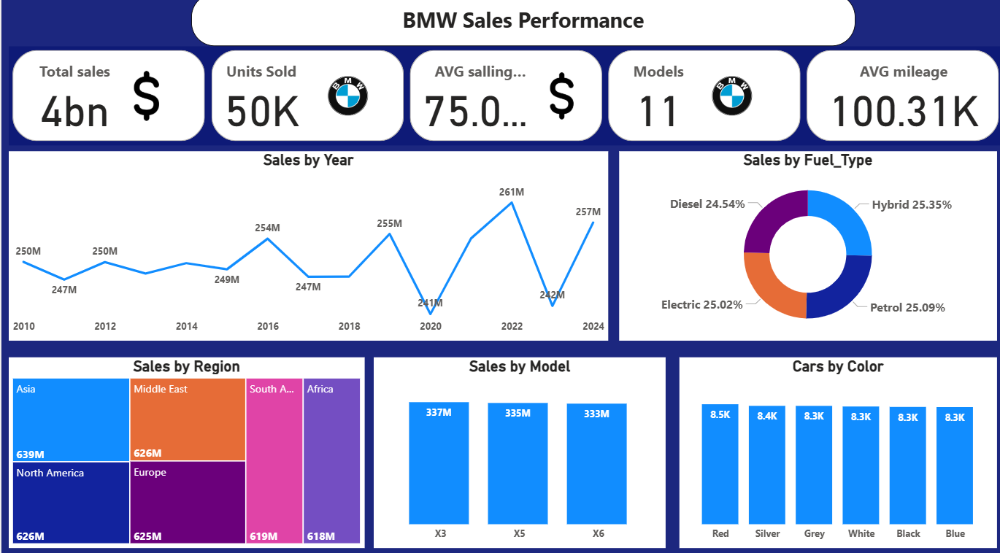
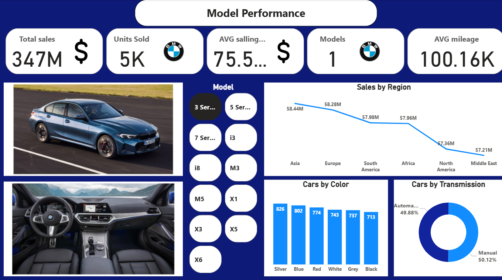

# 🚗 BMW Sales Performance Dashboard

## 📊 Overview
This project presents an interactive dashboard for **BMW Sales Performance** analysis.  
It visualizes key business metrics such as:
- Total sales  
- Units sold  
- Average selling price  
- Average mileage  
- Sales by year, model, region, fuel type, and color  

The dashboard provides both:
- **Global BMW performance overview**, and  
- **Detailed performance by model**  

---

## 🧠 Objectives
The goal of this dashboard is to help analyze and compare BMW car models’ performance across regions and fuel types, providing insights into:
- Market trends  
- Model-specific performance  
- Color and transmission preferences  
- Regional sales distribution  

---

## ⚙️ Tools Used
- **Power BI / Tableau / Excel (specify what you used)** for dashboard creation  
- **Data cleaning & transformation:** Excel / Python (Pandas)  
- **Visualization:** Charts, maps, donut charts, and cards  

---

## 🗂️ Data Sources
The dataset used in this project contains the following tables:

1. **Main Sales Table**
   - Includes model name, sales amount, region, fuel type, transmission, and color.

2. **Model Images Table (Created Manually)**
   - Since the original dataset did not include any image data for BMW models,  
     I created an additional table containing image URLs for each model (e.g., 3 Series, X5, i8, etc.).  
   - This table was then **linked to the main sales table** through the **model name field**,  
     enabling the visualization of car and interior images in the model performance dashboard.

---

## 🔗 Data Model
The data model connects:
This relationship allowed the dashboard to dynamically display car images and related stats when a model is selected.

---

## 📈 Dashboard Pages
1. **BMW Sales Performance (Overview)**
   - Global performance summary  
   - Sales trend over years  
   - Sales by fuel type, region, and model  
   - Distribution by car color  

2. **Model Performance (Details)**
   - Focused performance by selected BMW model  
   - Regional breakdown  
   - Car colors and transmission type statistics  
   - Model-specific images (exterior & interior)  

---

## 🖼️ Preview

### 🌍 BMW Sales Overview

### 🚘 Model Performance

---

## 🧩 Key Insights
- BMW sales are evenly distributed across all fuel types (Petrol, Diesel, Hybrid, Electric).  
- Asia leads in total sales, followed by the Middle East and North America.  
- Models like **X3**, **X5**, and **X6** are top performers.  
- Transmission types are almost equally split between **Manual** and **Automatic**.  

---

## 💡 Future Improvements
- Integrate live data updates from APIs  
- Add KPI comparison by year  
- Use predictive modeling for future sales trends  

---

## 🧑‍💻 Author
**Mohamed Eltmsah**  
📧 [https://www.linkedin.com/in/mohamed-eltmsah/]  
📅 October 2025  

---

